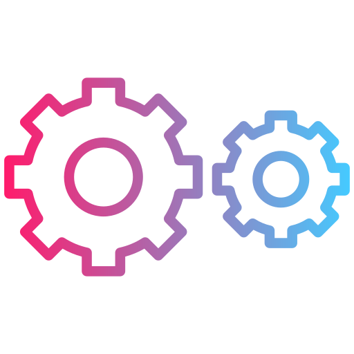

# Hi, I'm Oseias Saboia 

## I’m a Software Engineer. Currently I'm working as a Web Developer at Lampp-it Solutions <a href="https://www.linkedin.com/company/lampp-it-solutions/mycompany/" target="_blank">**LAMPP-IT Solutions**</a>.

### My current tools

 Software Developer  
 Back-end with .NET and Nodejs  
 Front-end Web with Reactjs  
 Typescript, Javascript, TailwindCSS, HTML, CSS  
 And more...

 

  <a href="https://github.com/gabrielmelogm">
  
  

##

 
  
  
    

